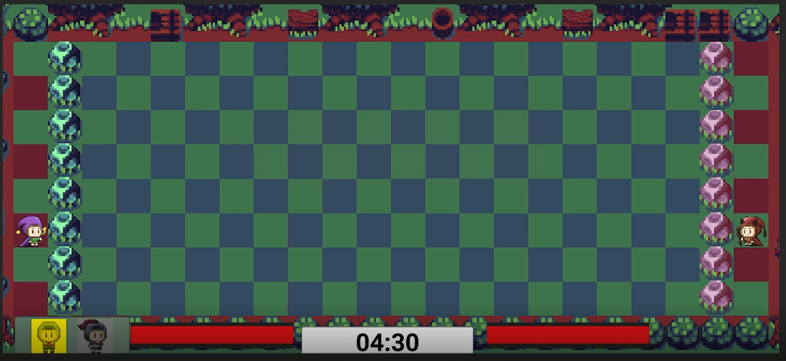
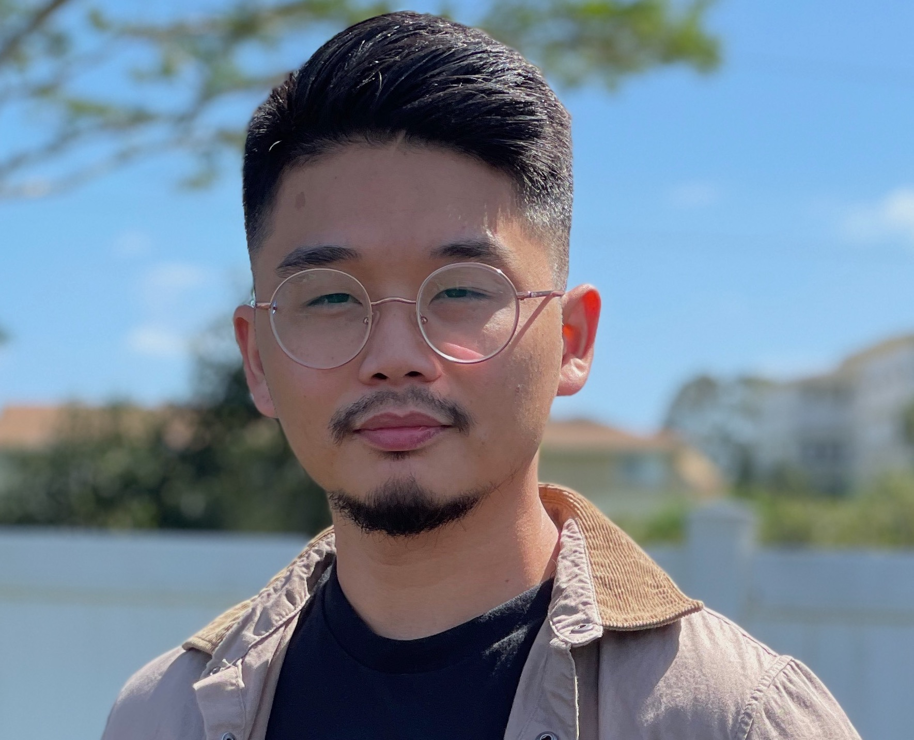

# Table of Contents
- [Overview](#overview)
- [Team Ideas](#team-ideas)
- [Prototype](#prototype)
- [Final product](#final-product)
- [Team Members](#team-members)
- [Trello Board](#trello-board)

# Overview
- brief synopsis of the game, give a short elavator summary about the game
- brief synopsis of the gameplay

## Team Ideas
- Screen shot of the brains storm idea?

## Prototype
- Demo Video:

- Early stages of the Game:
  - Player Side:
  
     
     
  - Player Side UI:
  
     
     
  - Enemy Side:
  
     
     
  - Early Win scene:
    
     
  - Early Gameplay
  
     

## Final Product
- put image with link to a channel that demonstrate the game
- put the link to where the game is currently hosted in

## Team Members

### 1. [Marcos Buccat](https://buccatm.github.io/)

- ICS Student, Senior
- Include your individual Brainstoorm Documentation??
- Implemented the Player Side:
  - Player movment
  - Player power ups
  - Player spells
  - Player Side summoning Units
- Implemented all of the player units behaviors
- Implemented the Win & Lose Conditions
- Implemented the Functionality of the Start, Win, and Lose scnene
 
### 2. [Glen Larita](https://glarita.github.io/)

- ICS Student, Senior 
- Include your individual Brainstoorm Documentation???
- Responsible for implementing all behavior and functionality on the enemy AI side.
- Implemented: 
   - The enemy movements
   - The enemy's attacks (the fireball and mega fireball).
   - The enemy's spawns and unit scripts
   - The enemy's behavior change as the game is played out
   - Enemy side unit behavior
   - Sounds for all AI units and the enemy
   - Increased spawn rate of units over time
   - implemented animation of characters provided by Jestiny
   - Implemented change in background music when enemy health reaches 50%

### 3. Jestiny Lubas
- URL of your home page, linked in?
- Picture of your Team member
- State your standing and whether you are ICS or ACM
- Include your individual Brainstoorm Documentation???
- Put Stuff that I did here

# Trello Board
- [Team Trello Board](https://trello.com/b/p0tyVYj3/sorcerer-duel)
