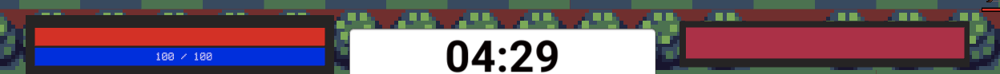

# Table of Contents
- [Overview](#overview)
- [How to Play](#how-to-play)
- [Team Ideas](#team-ideas)
- [Early Prototype](#early-prototype)
- [Final Version](#final-version)
- [Team Members](#team-members)
- [Trello Board](#trello-board)

# Overview
Sorcerer's Duel is a tower defense game, but without the tower! Instead, YOU are the tower! Your goal is to defeat the enemy with a wide range of attacks, spells, and soldier units and survive the onslaught of attacks aimed towards you. You can use fireballs to directly damage the enemy from the minute the game starts, or destroy the barriers protecting the enemy using your soldier units to deal more damage. But be careful, the enemy can do the same. The longer the duel lasts, the more powerful the enemy becomes, so be sure to start out strong, prepare for a magical battle and be ready to get your duel on!

## Gameplay Demo

## Play The Game
[Play Sorcerer Duel](https://glarita.itch.io/sorcerers-duel-game)

## How to Play
### Controls
Movement:
w: move up
s: move down
space: shoot fireball

Spells
1: Meteor shower
2: Laser beam
3: Laser beam special attack

Summoning and Switching Units:
a: switch to left unit
d: switch to right unit
left mouse: summon unit from a barrier by clicking on the barrier you wish the unit to be summoned from.

The goal of the game is to defeat the enemy by dealing damage. You can do this by hitting the enemy with fireballs, or destroying one of the enemy's barriers and sending units to attack that opening. As the game goes on, the enemy will also summon units to attack your barrier. You can defend yourself from these units by sending your own units in the same lane to fight. 

There are a total of 7 lanes, all of which you can send units on to attack or defend against the enemy. 

Our game implements a rock-paper-scissor damage dealing mechanism for its units:
- Archer units are effective towards the knight units
- Knight units are effective towards horsemen units
- Horsemen units are effective towards archer units

A health bar and a mana bar is present on the player's side. The mana bar helps the player keep track of how much mana they have, which will allow the player to utilize spell attacks towards the enemy units. 

Once the enemy's health bar has reached zero the player wins the game. If the player's health bar reaches zero the enemy wins. 

## Team Ideas
- Screen shot of the brains storm idea?

# Early Prototype
## Demo Video

## Early stages of the Game
  - Player Side:
  
     
     
  - Player Side UI:
  
     
     
  - Enemy Side:
  
     
     
  - Early Win scene:
    
     
  - Early Gameplay
  
     
     
# Final Version
## Gameplay 
### Early Stage

### Late Stage

## Starting Menue

## Lose Menue

## Win Menue

## Player Side   
   
   
## Player Interface
   - Unit, Spell Card, and Kill Counter Interface
   
   
   
   - Player Unit Counter, Health & Mana Bar, and Timer
   
   
   
## Player Spells
- Spell 1
  - Fires meteors to all enemies in range

- Spell 2
  - Shoots a laser at player position
  

- Spell 3
  - Shoots laser at the barriers positions
  - The lasers shoot in 3 patterns

## Power Ups
- Apple Read
  - Heals Player Unit & Player
   
   
   
- Apple Blue
  - Gives Mana Back to player
  
  
  
- Apple Green
  - Damages the Enemy Player
  
  

## Enemy Side

## Units
### Player Units
- Archer
  - Counters Knight unit
  - Shoots arrows, dealing extra damage to knight units
  - Weak against Horsemen

- Knight
  - Counters Horsemen units
  - Unit contains 2 hitpoints, armor and health points
  - Unit starts taking damage once armor is depleted
  - Deals extra damage to Horsemen & reflects damage to charging units
  - Weak Against Achers

- Horsemen
  - Counters Archer units
  - Fast and can charge at units
  - Charging at units deals extra damage execpt for Knight units
  - Weak against Knigh units

### Enemy Units
- Archer
  - Counters Knight
  - Shoots arrows, dealing extra damage to knight units
  - Weak against Horsemen

- Knight
  - Counters Horsemen units
  - Unit contains 2 hitpoints, armor and health points
  - Unit starts taking damage once armor is depleted
  - Deals extra damage to Horsemen & reflects damage to charging units
  - Weak Against Achers

- Horsemen
  - Counters Archer units
  - Fast and can charge at units
  - Charging at units deals extra damage execpt for Knight units
  - Weak against Knigh units

# Team Members

## 1. [Marcos Buccat](https://buccatm.github.io/)

- ICS Student, Senior
- Include your individual Brainstoorm Documentation??
- Implemented the Player Side:
  - Player movment
  - Player Side summoning Units
  - Player Unit Cards 
  - Player Spell cards
  - Player Health & Mana Bar
- Implemented all of the player units behaviors
  - Implemented Archer Shoot arrow mechanics
  - Implemented Knight's Armor mechanics
  - Implemented Horsemen Charge mechanics
- Implemented Player Abilities
  - Implemented Spell 1, fire meteors to all enemies in range
  - Implemented Spell 2, shoot laser at player's position
  - Implemented Spell 3, shoot lasers to all lanes into 3 patterns
  - Implemented Special Rally ability, to summon any unit to all the lanes
- Implemented the Win & Lose Conditions
- Implemented Player Power Ups
  - Implemented Apple-Read, to heal player and the unit
  - Implemented Apple-Blue, to give mana to player, random amount
  - Implemented Apple-Green, to damage the enemy directly
- Implemented the Functionality of the Start, Win, and Lose scnene
 
## 2. [Glen Larita](https://glarita.github.io/)

- ICS Student, Senior 
- Include your individual Brainstoorm Documentation???
- Responsible for implementing all behavior and functionality on the enemy AI side.
- Implemented: 
   - The enemy movements
   - The enemy's attacks (the fireball and mega fireball).
   - The enemy's spawns and unit scripts
   - The enemy's behavior change as the game is played out
   - Enemy side unit behavior
   - Sounds for all AI units and the enemy
   - Increased spawn rate of units over time
   - implemented animation of characters provided by Jestiny
   - Implemented change in background music when enemy health reaches 50%

## 3. Jestiny Lubas
 
 
- ACM Student, Senior
- In charge of creating asset sprites
- Designed and created character sprites

### Horsemen Sprites
Horsemen Walking

Horsemen Attacking

Horsemen Dead

Horsemen Hurt

### Knight Sprites

Knight Walking

Knight Attacking

Knight Dead

Knight Hurt

### Archer Sprites
### Player Srpites
### Enemy Sprites
### Spell Sprites
### Power Up Sprite

- Created magic spell sprites
  - Metorite
  - Laser
  - Fireball projectiles
- Created extra asset sprites
  - Healing apple
  - Bow and Arrow
- Created animations for character sprites

# Trello Board
- [Team Trello Board](https://trello.com/b/p0tyVYj3/sorcerer-duel)
